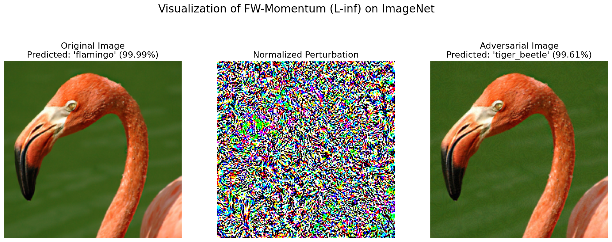
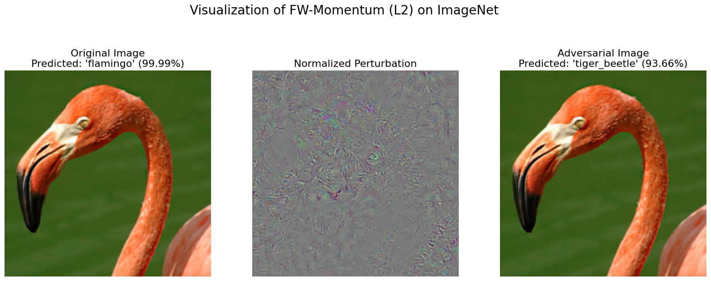
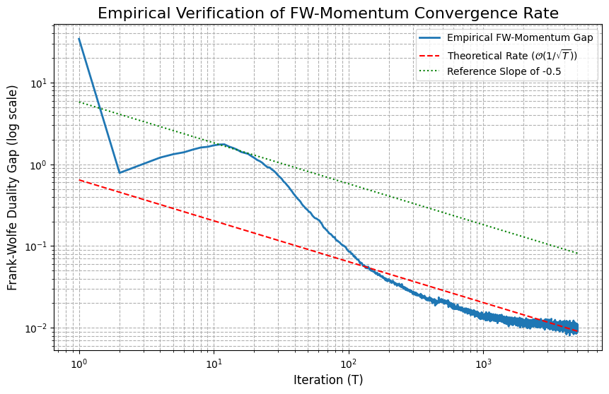

# Frank-Wolfe and Projected Gradient Methods for Adversarial Attacks

Implementation of adversarial attack algorithms comparing projection-free (Frank-Wolfe) and projection-based (PGD) optimization methods on neural networks.

## 📋 Overview

This repository contains the implementation and experimental evaluation from the paper "Frank-Wolfe and Projected Gradient Methods for Adversarial Attacks" by Angelo Guarino, Laura Martini, and Manuel D'Alterio Grazioli.

We explore white-box adversarial attacks from a constrained optimization perspective, comparing several algorithmic approaches:

### Implemented Algorithms
- **Frank-Wolfe Variants**:
  - Standard Frank-Wolfe (FW)
  - Frank-Wolfe with Momentum (FW-Momentum)
  - Away-Steps Frank-Wolfe (AFW)
  - Pairwise Frank-Wolfe (PFW)
- **Projection-Based Methods**:
  - Projected Gradient Descent (PGD)
  - Momentum Iterative Fast Gradient Sign Method (MI-FGSM)

## 🚀 Key Features

- **Projection-free optimization**: Frank-Wolfe methods avoid costly projection steps
- **Multiple norm constraints**: Support for both L₂ and L∞ attacks
- **Comprehensive evaluation**: Tests on MNIST and ImageNet datasets
- **Convergence analysis**: Empirical verification of O(1/√T) convergence rate
- **Multiple stopping criteria**: Attack success and convergence-based (duality gap/projected gradient norm)
- **Step-size strategies**: Line search and decreasing step-size implementations

## 📁 Project Structure

```
├── LICENSE
├── pretrainCNN_MNIST.ipynb      # Pre-training CNN model on MNIST
├── mnist_cnn.pth                # Saved pre-trained MNIST CNN model
└── advAttacks_main.ipynb        # Main notebook with all experiments
```

## 🔬 Main Results

Our experiments demonstrate that:

1. **Frank-Wolfe with momentum** consistently achieves the highest Attack Success Rate (ASR)
2. **Projection-free methods** are competitive and often faster than projection-based methods for L∞ attacks
3. **L∞ attacks** achieve higher success rates with lower distortion compared to L₂
4. **ImageNet models** are more sensitive to adversarial perturbations than MNIST models

### Performance Highlights

#### MNIST Dataset (L∞, ε=0.3, line search, duality gap)
| Method      | ASR (%) | Iterations | Distortion | Time (s) |
|-------------|---------|------------|------------|----------|
| FW-Standard | 94.0    | 27.91      | 0.294      | 26.63    |
| FW-Momentum | 100.0   | 40.0       | 0.300      | 37.95    |
| PGD         | 99.0    | 37.02      | 0.2952     | 43.67    |
| MI-FGSM     | 98.0    | 38.19      | 0.2979     | 45.95    |

#### Key Findings
- **FW-Momentum** achieves 100% ASR with competitive distortion levels
- **Projection-free methods** show faster per-iteration runtime compared to PGD
- **L∞ attacks** consistently outperform L2 attacks in both success rate and distortion

<div style="display: flex; flex-direction: column; align-items: center; gap: 10px;">
  
  
</div>

## 🛠️ Requirements

- Python 3.x
- PyTorch
- NumPy
- Matplotlib
- torchvision
- ResNet18 (for ImageNet experiments)

## 📊 Usage

### 1. Pre-train the CNN Model (MNIST)
First, run the MNIST CNN training notebook to create the target model:
```bash
jupyter notebook pretrainCNN_MNIST.ipynb
```
This will generate `mnist_cnn.pth` containing the pre-trained CNN model.

### 2. Run Adversarial Attacks
Execute the main notebook containing all experiments:
```bash
jupyter notebook advAttacks_main.ipynb
```

The main notebook includes:
- **Algorithm implementations**: All FW variants, PGD, and MI-FGSM
- **Perturbation analysis**: Sweep across ε values to find optimal attack ranges
- **Norm comparison**: L₂ vs L∞ constraint evaluation
- **Step-size strategies**: Decreasing (γt = 2/(t+2)) and line search
- **Stopping criteria**: Attack success vs convergence (duality gap/projected gradient norm)
- **Convergence analysis**: Empirical verification of O(1/√T) rate
- **Visualizations**: Attack success plots, adversarial examples, and convergence graphs

## 📈 Experimental Setup

### Datasets and Models
- **MNIST**: Custom CNN architecture, low-resolution grayscale images
- **ImageNet**: ResNet18, high-resolution color images

### Perturbation Budgets
- **MNIST**: 
  - Explored range: ε ∈ [0.05, 0.30]
  - Selected: ε = 0.3 (L∞), ε = 3.5 (L₂)
- **ImageNet**: 
  - Explored range: ε ∈ [0.001, 0.013]
  - Selected: ε = 0.005 (L∞), ε = 1.0 (L₂)

### Experimental Configuration
- **Step-size strategies**: 
  - Decreasing: γt = 2/(t+2)
  - Line search: 10 discretized candidates
- **Stopping criteria**:
  - Attack success: Stops when prediction changes
  - Convergence: Duality gap < 10⁻⁵ (FW) or projected gradient norm < 10⁻⁵ (PGD)
- **Momentum parameter**: β = 0.9 (for FW-Momentum and MI-FGSM)

### Key Observations
- **Zig-zagging issue**: Vanilla FW suffers when optimal point lies on constraint boundary
- **Success vs Convergence**: Success criterion yields ~9.44% confidence, convergence achieves ~99.68%
- **Away-steps and Pairwise variants**: Address zig-zagging, achieve linear convergence in a convex setting
- **FW-momentum**: achieves O(1/√T) convergence rate

<div style="display: flex; flex-direction: column; align-items: center; gap: 10px;">
  
</div>

## 📚 References

1. Jinghui Chen, Dongruo Zhou, Jinfeng Yi, Quanquan Gu. 2019. A Frank-Wolfe Framework for Efficient and Effective Adversarial Attacks. [arXiv:1811.10828](https://arxiv.org/pdf/1811.10828)
2. Immanuel M. Bomze, Francesco Rinaldi, Damiano Zeffiro. 2021. Frank-Wolfe and friends: a journey into projection-free first-order optimization methods. [arXiv:2106.10261](https://arxiv.org/pdf/2106.10261)
3. Martin Jaggi. 2013. Revisiting Frank-Wolfe: Projection-Free Sparse Convex Optimization. [MLR Press](https://proceedings.mlr.press/v28/jaggi13-supp.pdf)
4. Simon Lacoste-Julien, Martin Jaggi. 2015. On the Global Linear Convergence of Frank-Wolfe Optimization Variants. [arXiv:1511.05932](https://arxiv.org/pdf/1511.05932)
5. Cyrille W. Combettes, Sebastian Pokutta. 2021. Complexity of Linear Minimization and Projection on Some Sets. [arXiv:2101.10040](https://arxiv.org/pdf/2101.10040)
6. Laurent Condat. 2016. Fast Projection onto the Simplex and the l1 Ball. Mathematical Programming, Series A, 158 (1), pp.575-585.
7. Dong et al. 2018. Boosting Adversarial Attacks with Momentum. [arXiv:1710.06081](https://arxiv.org/pdf/1710.06081)

## 👥 Authors

- Angelo Guarino
- Laura Martini
- Manuel D'Alterio Grazioli

## 📄 License

This project is licensed under the MIT License - see the [LICENSE](LICENSE) file for details.